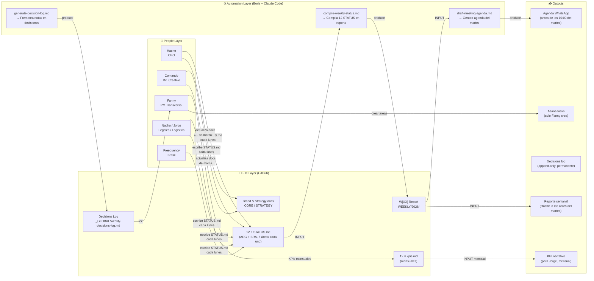
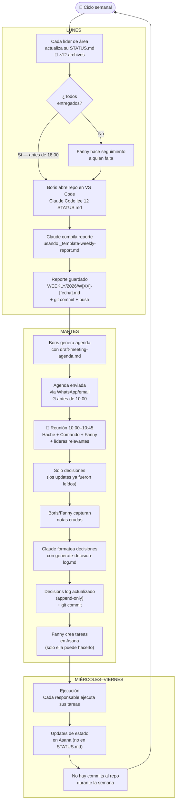
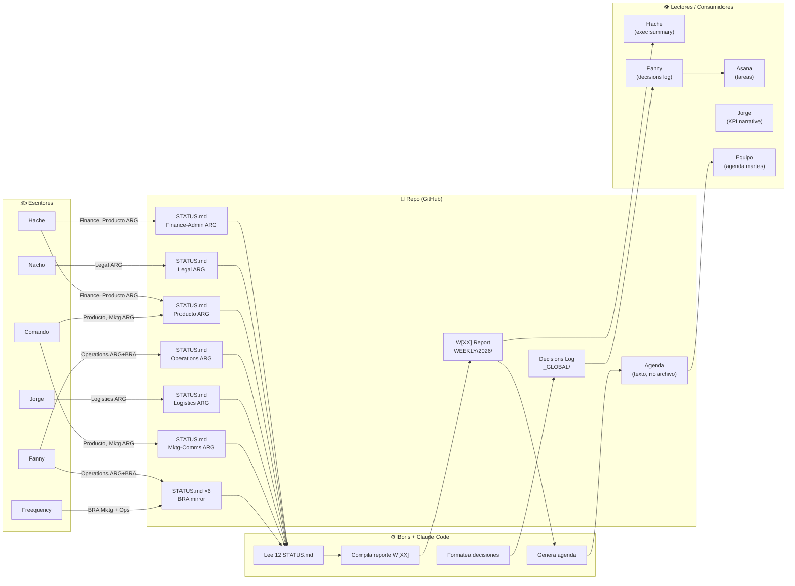
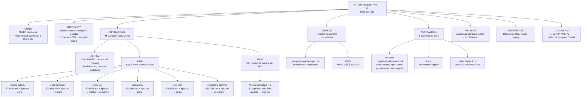

# Terrible Enfant OS1 — System Diagrams

Four diagrams. Read in order: layers → weekly cycle → data flow → folder structure.

---

## 1. System Layers Overview

---

## 2. Weekly Operational Cycle

---

## 3. Data Flow — Quién escribe, quién lee

---

## 4. Folder Structure

---

*Generado automáticamente con Claude Code — actualizar si cambia la estructura del repo.*
